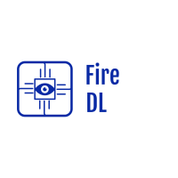
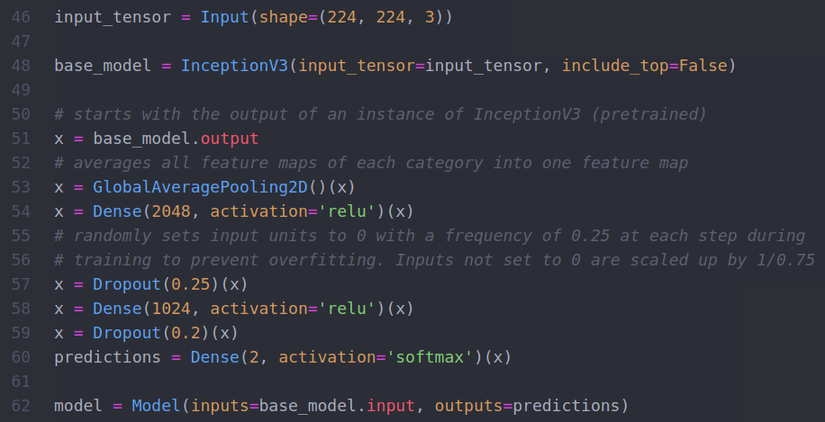
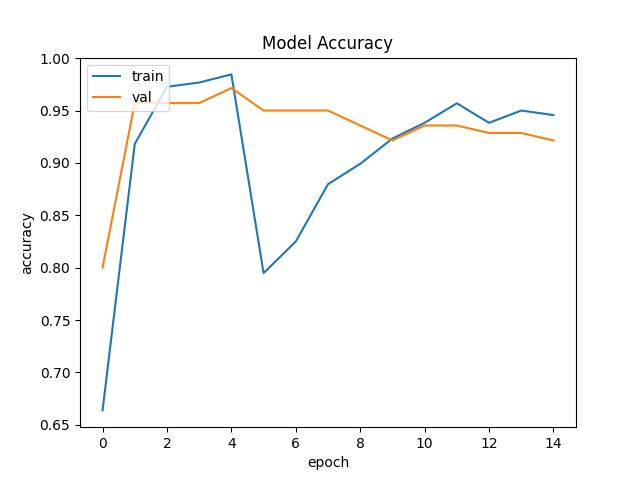

# Fire DL

## Table of Contents
- [Overview](#Overview)
- [Architecture](#Architecture)
- [Usage](#Usage)
  - [Dependencies](#Dependencies)
  - [Development](#Development)
- [Results](#Results)
- [Future Work](#Future-Work)


## Overview
### Description
Deep Learning convolutional neural network model to detect fire using built-in/external web cam. The idea is to be able to detect fire without the need for any sensors, just a simple, low quality webcam!
The model plays alarm sound when fire is detected for 8 consecutive frames (1/2 of a second for a 16 frame feed), ensuring that the alarm is not set off incorrectly for false positives.

*This application does NOT collect/send any user data. All frames of the camera video feed are collected and operated on for classification locally and are neither saved locally nor sent to a server for processing.*

<p align="center">
  
</p>


*You may refer to the test.mp4 file to hear the blasting sound of the alarm when triggered. Make sure you put your volume down a knob!*

### Program Evaluation
- **Category:** Safety
- **Story:** Allows user to use an external camera attached to any usb port of a computer to monitor the air for smoke and fire. In case of a fire, the program sets a fire alarm off. We plan to integrate smarter action in the case of fire by integrating a fire alarm telegram bot with the software, which has been implemented dbut has yet to be integrated.
- **Market:** This is designed with the people of developing nations in mind. Tens of countries don't have access to sophisticated fire alarms and smoke detectors, and even if they do they are not affordable and not regulated. This piece of software allows users to salvage a webcam from an old laptop, add a usb connector to it, and use it without a problem. The app is not intended for profit and is available as an open source for anyone who can benefit from it.
- **Habit:** If to be used as intended, the app is meant to be run on a daily basis 24/7 for fire detection. It would be much more convenient to upload the software on a dedicated microcontroller then, which is what we are looking for at the moment!
- **Scope:** The scope of this app is local, as you don't need to have an account or internet access to use it. The usage and testing of this app doesn't require more than one user to undertake.

## Architecture
The DL model is a transfer learning model based on the InceptionV3 model. The InceptionV3 is used as a base model, allowing our model to borrow strong knowledge from a model that has been successfully trained for different, yet somewhat similar, tasks. Our model re-purposes the InceptionV3 layers and adds to them to achieve our own task of classifying fire images. 

To that end, we perform 2D global average pooling, add 2 fully connected layeres and 2 dropout layers, and add a final FC layer of 2 nodes with softmax activation for the final prediction. 

<p align="center">
  
</p>

We use this archeticture to train the model with 2 different optimizers. We use Adam for a number of epochs, and then we fit more layers with the SGD optimizer for a number of epochs.

This process yields a trained model, capable of distinguishing fire and non-fire images. The model is then used to detect fire from a camera video feed by analyzing and classifying every frame and reporting fire if fire has been detected.

## Usage
```shell
python3 fire-detection.py
```
### Dependencies
You need to have TensorFlow and Keras installed with pip to run the training model. the playsound package and PIL are also needed. 
```shell
  pip install keras
  pip install --upgrade tensorflow
  pip install playsound
  pip install Pillow
```
*Although this was created as a learning and practice tool to watch and learn from the training process, we are working on saving a well-trained model through pickle and allowing the user to use the application without going through the training process.*

### Development
There are a bunch of hyperparamters to tune for different possible outcomes. For example, for places where a fire incident is more likely, you may want to adjust the condition for setting the alarm to be on 65% certatinty, instead of the current 75%. In other words, the algorith has to be at least 65% sure that a fire is happening. On the other hand, in most cases, you will find a certatinty of 75-85 ideal. Changing this hyperparameter is done through manipulating the value at line 151 in the code and we plan to pull this out to command line level, allowing user to fiddle with it while running the program. Here is a list of hyper parameters and how to adjust them:

* Certainty: 
Can be increased or decreased by adjusting the probabilities[prediction] condition.
<p align="center">
  
</p>

* Epochs, steps per epoch, and validation steps for the layers optimized by the Adam optimizer:
<p align="center">
  
</p>

* Epochs, steps per epoch, and validation steps for the layers optimized by the SGD optimizer:
<p align="center">
  
</p>

## Results
With the recommended hyperparamaters specified in the comments above, we get excellent validation and test accuracy >90%
<p align="center">
  
</p>

## Future Work

- [ ] User can specify hyperparameters in the command line level.
- [ ] User can use a well-trained pre-saved model without having to go through the training process.
- [ ] User can sign in with Telegram credentials to get notifications from a Fire DL Telegram Bot.
- [ ] GUI. 

